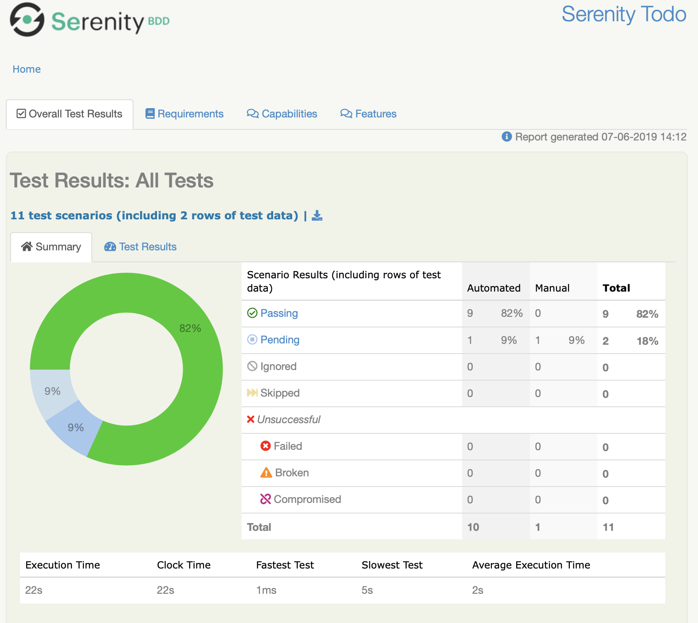
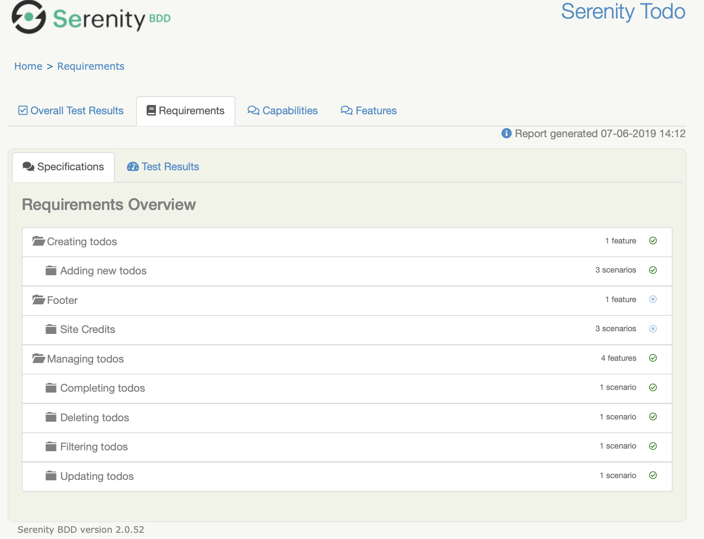
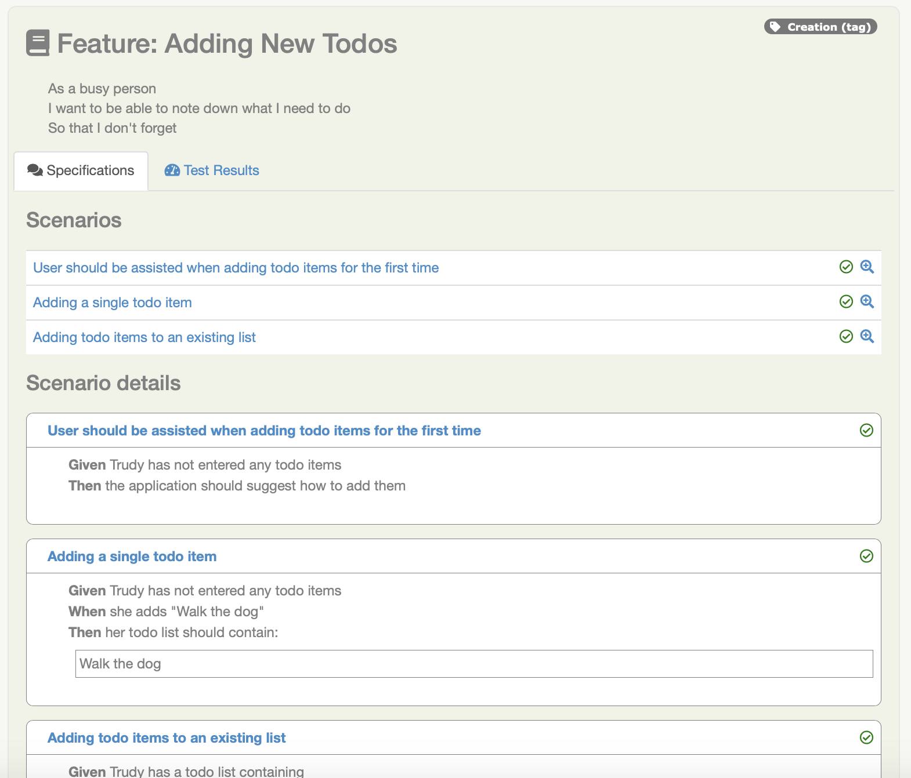
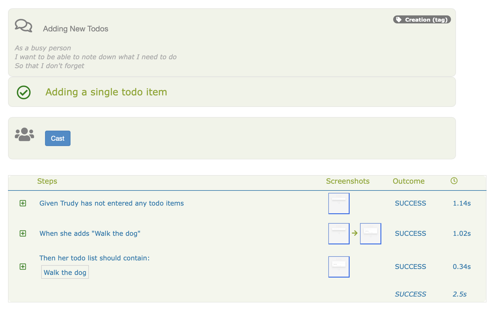

<a id="summary">

# 

### That feeling you get when you know you can trust your tests

Serenity BDD is a library designed to make writing automated acceptance tests easier, and more fun. 

## What does it do?

Serenity helps structure your automated acceptance tests in order to make them easier to understand and maintain, 
and provides great reporting capabilties on top of tools like Cucumber and JUnit. It also provides tight integration 
with WebDriver and RestAssured, to make both web testing and API testing easier and more efficient.

Serenity works in two ways:
  - It instruments your test code and reports on the steps that your tests execute to achieve their goals, and stores the test
  results in a standardized format;
  - It aggregates these test results into clear and meaningful reports, that reflect not only the outcomes of your tests,
  but also the status of your project. For example, you can get Serenity to report on what requirements, features or stories
  you have implemented, and how well (or not) they were tested.
  
### Serenity makes your test cleaner

Serenity provides libraries and patterns that make it easier to write cleaner, more reusable code. It provides tight integration with Selenium WebDriver, and modern testing patterns such as Lean Page Objects, Action Classes, and the [Screenplay Pattern](https://serenity-bdd.github.io/theserenitybook/latest/serenity-screenplay.html). You can learn more about these patterns [in this article](https://johnfergusonsmart.com/page-objects-that-suck-less-tips-for-writing-more-maintainable-page-objects/).

### Serenity makes your reports richer

Serenity reports aim to be more than simple test reports - they are designed to provide _living documentation_ of your product. 
The reports give an overview of the test results:



But they also let you document your requirements hierarchy, and the state of the acceptance criteria associated with your requirements:



When you use BDD tools like Cucumber or JBehave, Serenity will include the feature details in a format that both team members and business folk can read:



And if you drill into the details, Serenity will give you a detailed account of how the test played out, including interactions and screenshots:



  
## Where can I learn more?

Check out Serenity BDD in more detail here:
* [User Guide](https://serenity-bdd.github.io/theserenitybook/latest/index.html)
* [](https://www.javadoc.io/doc/net.serenity-bdd/serenity-core)
  
## What is the latest stable version I should use?

The tables below list the latest stable versions of Serenity BDD and other related libraries.

### Serenity with JUnit

| serenity-core | serenity-maven-plugin | Selenium version  |  RestAssured version |
|---------------|-----------------------|-------------------|----------------------|
| 2.0.52        | 2.0.52                | 3.141.59          | 3.3.0                |
| 2.0.48        | 2.0.48                | 3.141.59          | 3.3.0                |

Sample project: [Serenity JUnit Starter Project](https://github.com/serenity-bdd/serenity-junit-starter).

### Serenity with Cucumber
Serenity works with both Cucumber 2 and Cucumber 4

#### Cucumber 2

| serenity-core | serenity-maven-plugin | serenity-cucumber | Cucumber            |
|---------------|-----------------------|-------------------|---------------------|
| 2.0.54        | 2.0.54                | 1.9.39            | 2.4.0               |
| 2.0.52        | 2.0.52                | 1.9.39            | 2.4.0               |
| 2.0.48        | 2.0.48                | 1.9.37            | 2.4.0               |

Sample project: [Serenity Cucumber Starter Project](https://github.com/serenity-bdd/serenity-cucumber-starter).

#### Cucumber 4

| serenity-core | serenity-maven-plugin | serenity-cucumber4 | Cucumber            |
|---------------|-----------------------|--------------------|---------------------|
| 2.0.54        | 2.0.54                | 1.0.14             | 4.2.0               | 
| 2.0.52        | 2.0.52                | 1.0.14             | 4.2.0               | 
| 2.0.48        | 2.0.48                | 1.0.12             | 4.2.0               |
 
Sample project: [Serenity Cucumber 4 Starter Project](https://github.com/serenity-bdd/serenity-cucumber4-starter).

### Serenity with JBehave

| serenity-core | serenity-maven-plugin | serenity-jbehave  | JBehave             |
|---------------|-----------------------|-------------------|---------------------|
| 2.0.52        | 2.0.52                | 1.0.46            | 4.5                 |
| 2.0.42        | 2.0.48                | 1.0.45            | 4.5                 |

Sample project: [Serenity JBehave Starter Project](https://github.com/serenity-bdd/serenity-jbehave-starter).

## Version number format

Serenity uses a three-digit version number notation, with the following meaning:
```
 <major>.<minor>.<build>
```
The first and second digits are for more significant updates, including new features or important bug fixes. The third is 
updated automatically for every new release, and is generated by the build process.

## Commit message conventions
Commit messages are used to generate the release notes for each release. To do this, we loosely follow the AngularJS commit conventions: for commit messages to appear in the release notes, the title line needs to respect the following format:
```
  <type>: <message>
```

where <type> is one of the following:
  - feat: A new feature
  - fix: A bug fix
  - docs: Documentation only changes
  - style: Changes that do not affect the meaning of the code (white-space, formatting, missing semi-colons, etc)
  - refactor: A code change that neither fixes a bug or adds a feature
  - perf: A code change that improves performance
  - test: Adding missing tests
  - chore: Changes to the build process or auxiliary tools and libraries such as documentation generation

Also commits can consists of several lines - to include some additional information in relase notes. For example:
```  
feat: A new feature to make something better
now it will be available to call api.function() with additional parameters like api.function(Integer)
```
it will be included in release notes as:

 - feat: A new feature to make something better
     
     > now it will be available to call api.function() with additional parameters like api.function(Integer)

Please take a look at release notes to find some more examples of mutiline commits. 

**For more information, read the Contributing guide for this repo.**

Starting from version 1.1.26, any commits without one of these prefixes will not appear in the release notes.

## Licensing

This distribution, as a whole, is licensed under the terms of the Apache License, Version 2.0

## History - Serenity and Thucydides

Serenity was originally called [Thucydides](https://github.com/thucydides-webtests), and the package structure still reflects this history. 
Thucydides is discussed at length in the [BDD in Action](http://www.amazon.com/BDD-Action-Behavior-driven-development-lifecycle/dp/161729165X) 
under the name *Thucydides* - everything discussed in "BDD in Action" is directly applicable for Serenity except for the artifact names.

*Thucydides* was renamed *Serenity* in November 2014, and moving forward, all new work will be done on Serenity. The artifact names reflect this change, e.g.
  - *net.thucydides:thucydides-code* becomes *net.serenity:core*
  - *net.thucydides:thucydides-junit* becomes *net.serenity:serenity-junit*
  - *net.thucydides:thucydides-jbehave* becomes *net.serenity:serenity-jbehave*
  - *net.thucydides:thucydides-cucumber* becomes *net.serenity:serenity-cucumber*
 
and so on.

## Found a bug? Please read this before you raise an issue.

If you have found a defect, we are keen to hear about it! But there are a few things you can do to help us provide a fix sooner:

### Give as much context as possible.

Simply saying "The reports don't get generated" will not help us very much. Give as much context as possible, including:
  - Serenity version (serenity-core and the other serenity libraries, such as serenity-cucummber and serenity-jbehave)
  - If you are using Firefox, firefox and geckodriver version
  - If you are using Chrome, chrome and chromedriver version
  - What Operating System are you using

Also, make sure you try with the latest version of Serenity - your bug may already be fixed, and in any case error messages from the latest version will be more relevant when we try to track down the source of the problem.

### Use living documentation

It is easier for us to fix something we can see breaking. If someone has to volunteer an hour of there time to reproduce a defect, Start of with one of the Serenity started projects (like [this one](https://github.com/serenity-bdd/serenity-cucumber-starter) and add a scenario or test case that both illustrates and describes your issue. If possible, write the test to describe the behaviour you expect, so that it fails when the defect is present, and that it will pass when the defect is fixed.

### Submit a Pull Request

The fastest way to fix a defect is often to dig into the code and to submit a pull request. 

## Online Training

The **[Serenity Dojo](http://serenitydojo.teachable.com)** provides a range of online courses to help you learn BDD and test automation with Serenity BDD.

## Need Commercial Support?

If you are using Serenity for your company projects, and need faster or more in-depth support, why not ask your company to get some [commercial support](https://johnfergusonsmart.com/serenity-bdd/)? We provide a range of support options including prioritied tickets, custom Serenity work, and remote mentoring/pair programming sessions, depending on your needs.

Take a look at [this article](https://opensource.guide/how-to-contribute/#communicating-effectively) for more information.
